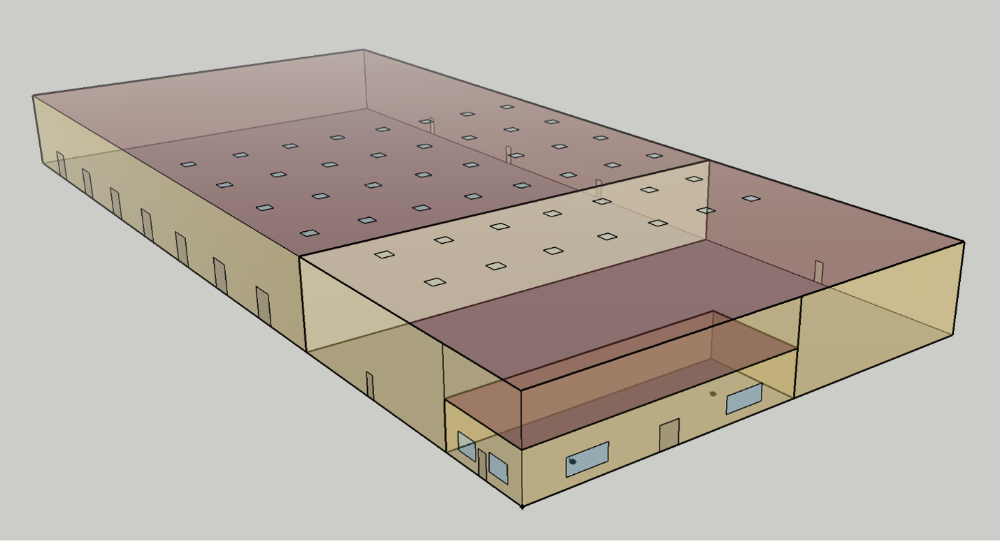

A guide to [TBD](https://github.com/rd2/tbd "TBD source code repository on GitHub") - an [OpenStudio Measure](https://nrel.github.io/OpenStudio-user-documentation/reference/measure_writing_guide/ "A guide to writing OpenStudio Measures") that auto-detects __major__ thermal bridges (like balconies, parapets and corners) and then __derates__ outside-facing opaque constructions (walls, roofs and exposed floors). The guide is mainly written for architects, technologists and envelope consultants who are new to energy simulation, and to OpenStudio in particular.

### In a nutshell ...

__Thermal bridges__ are structural elements that interrupt the continuity of insulation in building envelopes. A curtain wall spandrel back pan may hold in place an R17 (RSi 3.0) batt of insulation, yet the spandrel's overall R-value may trickle down to R5 (RSi 0.9) - less than a third of its nominal value. This drop in spandrel performance is due to its reliance on highly conductive materials (e.g. galvanized steel, aluminium), spandrel area & height-to-width ratio, and how the back pan is held in place continuously along spandrel edges.

__Minor__ thermal bridges are regularly-spaced supports or framing elements (such as studs and Z-bars): the initial _derated_ R-value stemming from _minor_ thermal bridging, generally known as a construction's _clear-field effective R-value_, is largely independent of a surface's actual geometry or adjacencies to other surfaces. This means design changes to surface geometry (e.g. floor-to-ceiling height, number of windows) can be made without having to update surface _clear-field effective R-values_ - very practical! For a few simple 2D framing configurations, the ASHRAE Fundamentals and ISO standards support established hand-calculations like the _parallel-path_ method. Yet in most cases, designers are better off consulting published collections of common configurations (with unique _clear-field effective R-values_), such as [BETBG](https://www.bchydro.com/powersmart/business/programs/new-construction.html "Building Envelope Thermal Bridging Guide") or [thermalenvelope.ca](https://thermalenvelope.ca).

__Major__ thermal bridging instead relates to a surface's geometry and its immediate adjacencies (e.g. thermal bridging along roof parapets, slab edges, corners, cantilevered balconies). While U-values (or interchangeably U-factors, in W/K per square meter) are suitable metrics for surface area heat loss (under _standard_ winter rating conditions), linear thermal conductances from _major_ thermal bridges are commonly annotated using the greek letter __psi__ (units in W/K per meter) - __khi__ for point conductances (e.g. a cantilevered beam or a column, in W/K per point). Both _BETBG_ and _thermalenvelope.ca_ links above provide useful _psi_ and _khi_ data for common cases.

Contrary to _minor_ thermal bridging, changing a room's height or adding windows should trigger a revised calculation of _major_ thermal bridging effects. This can be quite daunting, time-consuming and error-prone to do by hand (per design iteration), given the hundreds (if not thousands) of _major_ thermal bridges in a building model. The simple [US DOE Commercial Reference Warehouse Model](https://www.energy.gov/eere/buildings/commercial-reference-buildings "US DOE Commercial References") has over 300 of such _major_ thermal bridges - mostly around fenestration.



Relying on the OpenStudio [SDK](https://openstudio-sdk-documentation.s3.amazonaws.com/index.html "OpenStudio SDK") and the [Topolys](https://github.com/automaticmagic/topolys "Topolys source code repository on GitHub") gem, TBD automatically - and pretty instantaneously - identifies and manages _major_ thermal bridges behind the scenes for OpenStudio users.

### Energy simulation

While materials, constructions and envelope surfaces are well-defined variables in OpenStudio (and energy simulation engines like EnergyPlus), shared _edges_ and _points_ are simply not! TBD automatically factors in _psi_ and _khi_ losses from _major_ thermal bridges it manages, by further _derating_ a construction's _clear-field effective R-value_ - more specifically by further decreasing its insulating layer thickness. If the insulation layer becomes too thin, TBD then increases insulation conductivity. This approach, in line with published research and standards such as ASHRAE's [RP-1365](https://www.techstreet.com/standards/rp-1365-thermal-performance-of-building-envelope-details-for-mid-and-high-rise-buildings?product_id=1806751), _BETBG_ & _thermalenvelope.ca_, as well as ISO [10211](https://www.iso.org/standard/65710.html) and [14683](https://www.iso.org/standard/65706.html) Standards, is best summarized as follows:
```
Ut = Uo + ( ∑psi • L )/A + ( ∑khi • n )/A
```
... where:

__Ut__ : _derated_ construction transmittance  
__Uo__ : initial _clear field_ transmittance  
__psi__ : linear _edge_ transmittance  
__L__ : length of the _edge_  
__khi__ : e.g. column _point_ transmittance  
__n__ : number of similar columns  
__A__ : opaque surface area  

TBD users are required to initially select generic __psi__ and __khi__ values that best characterize the _major_ thermal bridges in their project (see TBD [Basics](./pages/basics.html "Basic TBD workflow")). TBD will apply these values against individual _edge_ occurrences Topolys identifies in the OpenStudio model. Geometric variables like __L__ and __A__ are also automatically extracted from the model (... __n__ requires special treatment, discussed in the [Customization](./pages/custom.html "Customizing TBD inputs") section).

Each OpenStudio construction is comprised of multiple material layers (typically 2 or 3 at a minimum), each of which has a thermal resistance. Users are expected to have already factored in _minor_ thermal bridging effects by e.g. decreasing the nominal thickness of the _insulating_ layer of each construction - a standard technique in energy simulation. __Uo__ is simply the inverse of the sum of resulting layer resistances and surface air films. Behind the scenes, TBD automatically generates new _derated_ materials and constructions - the latter having their own unique __Ut__.

In summary, users are required to have:
- a fully-enclosed OpenStudio model
- materials and layered constructions
- a shortlist of _psi_ and _khi_ values

... from there, TBD & Topolys will do the heavy lifting!

### Next?

- [TBD basics](./pages/basics.html "Basic TBD workflow")  
- [TBD customization](./pages/custom.html "Customizing TBD inputs")  
- [TBD reporting](./pages/reports.html "What TBD reports back")  
- [Uprating](./pages/ut.html "Uprating' assessments")  
- [UA'](./pages/ua.html "UA' assessments")  
- [KIVA](./pages/kiva.html "Kiva support")  


### Support

Merci aux gouvernements du [Québec](https://transitionenergetique.gouv.qc.ca) et du Canada ([CNRC](https://nrc.canada.ca/en/research-development/research-collaboration/research-centres/construction-research-centre), [CanmetÉNERGIE](https://www.nrcan.gc.ca/energy/offices-labs/canmet/ottawa-research-centre/the-built-environment/23341)).


_As with many [publicly](https://bcl.nrel.gov/dashboard "OpenStudio's Building Component Library") available OpenStudio Measures, TBD is open source, [MIT-licensed](https://github.com/rd2/tbd/blob/master/LICENSE "TBD's MIT license") and so provided "as is" (without warranty)._
