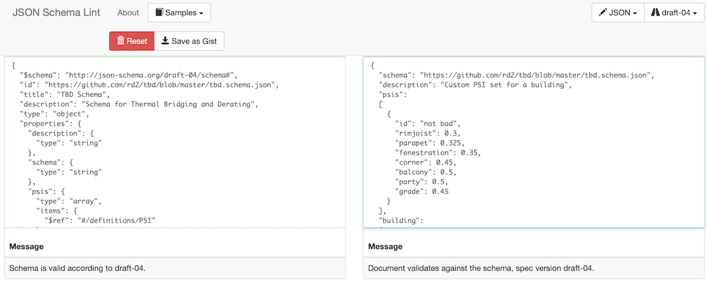

### Customization

TBD offers a pull-down menu list of prepackaged _psi_ sets - key for newcomers, especially in the early design stages (see [Basics](./basics.html "Basic TBD workflow")). What happens when design choices aren't well represented by any of these prepackaged sets? TBD allows users to define multiple custom _psi_ sets, refine them beyond the basic 7 TBD _shorthands_, and attribute them to different parts of a building model.

As detailed in the [Reporting](./reports.html "What TBD reports back") section, a unique _tbd.out.json_ output file is generated (or regenerated) for every TBD run, under an OpenStudio model's _files_ folder. If one drops a _tbd.json_ file in the same _files_ folder and CHECKS the __Load 'tbd.json'__ menu option, TBD will read in custom inputs defined in that file.

### Custom building _psi_ set

As a first example, consider the definition of a custom "building" _psi_ set - instead of TBD's pull-down menu options:  

```
{
  "schema": "https://github.com/rd2/tbd/blob/master/tbd.schema.json",
  "description": "Custom PSI set for a building",
  "psis":
  [
    {
      "id": "not bad",
      "rimjoist": 0.3,
      "parapet": 0.325,
      "fenestration": 0.35,
      "corner": 0.45,
      "balcony": 0.5,
      "party": 0.5,
      "grade": 0.45
    }
  ],
  "building":
  {
    "psi": "not bad"
  }
}
```
__SCHEMA__: Let's start with the tough part. TBD output & input files are:  

- JSON formatted
- structured following a TBD-specific JSON _schema_  

_Schema_? See this as a set of coded instructions on:  

- what's allowed as TBD input
- how this input should be JSON-formatted.  

Pretty much every compiled or assembled computer language has JSON functionality capable of reading in and validating JSON-formatted data. This ensures portability between machine architectures, computer languages and third-party software.

Currently, designers are yet to have access to online tools or BIM-integrated features that would help with JSON formatting and validating of TBD custom inputs. In the meantime, one can copy the content of TBD's [schema](https://github.com/rd2/tbd/blob/master/tbd.schema.json) and paste it in the left-side window of this free, online JSON [Linter](https://jsonschemalint.com/#!/version/draft-04/markup/json). Then copy the example _tbd.json_ content above, and paste in the right-side window:



... here, the Linter "Messages" inform us that everything is valid. Other times, they point to issues related to content, syntax and structure - which users can correct on the fly. Another option is to first generate a detailed _tbd.out.json_ file (by CHECKING the __Write 'tbd.out.json'__ option), renaming it as _tbd.json_, and customizing it directly. A combination of both options also works well.

__PSIs__: In order to refer to a custom _psi_ set, one must first define the custom set itself. TBD JSON "psis" each require a unique identifier (e.g. "not bad"), and the expected TBD _shorthands_ (e.g. "parapet") with their custom _psi_ factors (in W/K per meter). Note that the "joint" shorthand is optional: if one or more "transition" edges in a model are to become structural expansion "joints", then the custom _psi_ set should hold an additional "joint" entry.

__BUILDING__: TBD allows a single "building" JSON entry, where one simply refers to one of the previously defined _psi_ sets. This overrides the pull-down __Default thermal bridge set__ option.

### Multiple custom _psi_ sets

OpenStudio allows users to define default construction sets for an entire building model, which means any new wall surface added to a model automatically inherits the default wall construction - very handy. OpenStudio also allows users to further refine the solution by allowing default construction sets per individual _building story_ (e.g. ground floor surfaces vs the rest of the building), or on a _spacetype_ basis (e.g. housing units vs common spaces), and so on ... down to the individual surface.

TBD offers a mirror solution - custom _psi_ sets:  

- for the OpenStudio building as a whole
- per OpenStudio story
- per OpenStudio spacetype
- per OpenStudio space
- per OpenStudio surface  

```
{
  "schema": "https://github.com/rd2/tbd/blob/master/tbd.schema.json",
  "description": "Benchmark warehouse with custom spacetype psi sets",
  "psis":
  [
    {
      "id": "Warehouse Office",
      "parapet": 0.300,
      "corner": 0.300,
      "grade": 0.300
    },
    {
      "id": "Warehouse Fine",
      "parapet": 0.500,
      "corner": 0.500,
      "grade": 0.500
    }
  ],
  "building":
  {
    "psi": "regular (BETBG)"
  },
  "spacetypes":
  [
    {
      "id": "Warehouse Office",
      "psi": "Warehouse Office"
    },
    {
      "id": "Warehouse Fine",
      "psi": "Warehouse Fine"
    }
  ]
}
```
Successfully linking custom _psi_ sets and OpenStudio objects relies on their unique (case-sensitive) "id": here, "Warehouse Office" and "Warehouse Fine" are unique _spacetype_ object identifiers in one's OpenStudio model.  

A few additional notes:  

- here, the "building" _psi_ set refers to a TBD pull-down option
- therefore not necessary to define it as a custom _psi_ set
- this nonetheless overrides the selected pull-down option
- except for "building", custom _psi_ sets can be _partial_
- e.g. all "fenestration" edges inherit from the "building" set  

One can also customize individual edges (e.g. expansion "joints"), which do not have corresponding OpenStudio identified objects:
```
{
  "schema": "https://github.com/rd2/tbd/blob/master/tbd.schema.json",
  "description": "Demonstrating a custom edge",
  "psis":
  [
    {
      "id": "custom edge",
      "fenestration": 0.600
    }
  ],
  "edges":
  [
    {
      "psi": "custom edge",
      "type": "fenestration",
      "surfaces":
      [
        "Office Front Wall",
        "Office Front Wall Window 1"
      ]
    }
  ]
}
```
### _khi_ inputs

Cantilevered beams, columns, rooftop support blocks, etc. that partially or entirely traverse building envelope surfaces are best represented as point conductances, or _khi_ factors (in W/K per point). As there are no corresponding OpenStudio objects, TBD users must fall back onto custom surface attributes:
```
{
  "schema": "https://github.com/rd2/tbd/blob/master/tbd.schema.json",
  "description": "Adding khi items",
  "khis":
  [
    {
      "id": "column",
      "point": 0.7
    },
    {
      "id": "support",
      "point": 0.5
    }
  ],
  "surfaces":
  [
    {
      "id": "exposed floor 1",
      "khis":
      [
        {
          "id": "column",
          "count": 10
        },
        {
          "id": "support",
          "count": 4
        }
      ]
    }
  ]
}
```
Here, the OpenStudio surface "exposed floor 1" will inherit 10x 0.7 W/K (= 7 W/K) + 4x 0.5 W/K (= 2 W/K): an extra 9 W/K, in addition to the total W/K per meter from surrounding edges (i.e. linear thermal bridges) - automatically calculated by TBD.

### Extended _shorthands_

If one carefully examines a detailed _tbd.out.json_ file, one notices new or altered TBD _shorthands_ for individual edges e.g., "jamb", "sill" & "head" instead of "fenestration", as well as "concave" or "convex" variants e.g.:
```
{
  "psi": "poor (BETBG)",
  "type": "jamb",
  "length": 2.13349595113502,
  "surfaces": [
    "Fine Storage Left Door",
    "Fine Storage Left Wall"
  ],
  "v0x": 0.0,
  "v0y": 20.2682115357827,
  "v0z": 2.13349595113502,
  "v1x": 0.0,
  "v1y": 20.2682115357827,
  "v1z": 0.0
},
...
{
  "psi": "poor (BETBG)",
  "type": "parapetconvex",
  "length": 70.10058125157889,
  "surfaces": [
    "Bulk Storage Right Wall",
    "Bulk Storage Roof"
  ],
  "v0x": 45.7177703814647,
  "v0y": 30.4785135876431,
  "v0z": 8.53398380454007,
  "v1x": 45.7177703814647,
  "v1y": 100.579094839222,
  "v1z": 8.53398380454007
},
```
Here, "type" designates one of the possible (extended) TBD _shorthands_. Although one may have simply relied on a general "fenestration" _psi_ factor to start with, TBD will differentiate between fenestration "heads", "jambs" and "sills". In addition, TBD will add a "convex" or "concave" suffix to edges linking _envelope_ surfaces that aren't on the same 3D plane. A simple, rectangular building would have a minimum of 4 "convex" parapet edges, but a one-story extension to a 2-story building would (also) have at least one "concave" parapet edge.

If one comes across published _psi_ data that distinguishes between fenestration "heads", "sills" and "jambs" (the BETBG does hold some examples), and/or differences between "convex" vs "concave" corners, then one could customize a _tbd.json_ file as follows:
```
{
  "schema": "https://github.com/rd2/tbd/blob/master/tbd.schema.json",
  "description": "Enhanced, custom PSI set for a building",
  "psis":
  [
    {
      "id": "not bad",
      "rimjoist": 0.3,
      "parapet": 0.325,
      "head": 0.35,
      "sill": 0.40,
      "jamb": 0.30,
      "cornerconcave": 0.45,
      "cornerconvex": 0.40,
      "balcony": 0.5,
      "party": 0.5,
      "grade": 0.45
    }
  ],
  "building":
  {
    "psi": "not bad"
  }
}
```
There are obviously many, many possible combinations. TBD's GitHub repository contains some additional [examples](https://github.com/rd2/tbd/tree/master/json), yet many more on TBD's dedicated test [repo](https://github.com/rd2/tbd_tests/tree/develop/json). Although this may at first seem complex and intimidating for the average designer or modeller, it remains similar to OpenStudio with regards to default construction sets: it can be very simple, and it only needs to be as complex as the actual design. With such freedom (with both OpenStudio and TBD inputs) comes responsibility - something users and modellers must carefully consider and plan out accordingly.

### A side note on dimensioning

Envelope surfaces are usually modelled in OpenStudio based on _outer_ dimensions (i.e. following the exterior cladding, as in ASHRAE 90.1 and Québec's energy code), or on _inner_ dimensions (i.e. following the interior finishing, as in the Canadian NECB). For most _flat_ edges, this isn't critical. But for _concave_ or _convex_ edges, adjustments to _psi_ factors may be warranted if there is a mismatch in conventions between the OpenStudio model vs published _psi_ data. For instance, BETBG data reflect an _inner_ dimensioning convention, while ISO 14683 reports _psi_ factors for both conventions. The following equation may be used to adjust BETBG _psi_ factors for e.g., _convex_ corners, when relying on _outer_ dimensions in OpenStudio.
```
PSIe = PSIi + Uo * 2(Li - Le), where:

PSIe = adjusted PSI (W/K per m), as TBD input
PSIi = published PSI factor (W/K per m)
  Uo = average clear field effective U-factor (W/K per m2)
  Li = from interior corner to "zone of influence" limits (m)
  Le = from exterior corner to "zone of influence" limits (m)
```
The _zone of influence_ usually ranges between 1.0 to 1.2 meters. But the key parameter here is really the resulting wall thickness, and whether the sign is positive or negative - depending if it's a _convex_ or _concave_ corner. In some cases, this may even produce negative _psi_ factors - which TBD allows. The BETBG and ISO standards provide detailed discussions on the subject.

[BACK](../index.html "Thermal Bridging & Derating")
