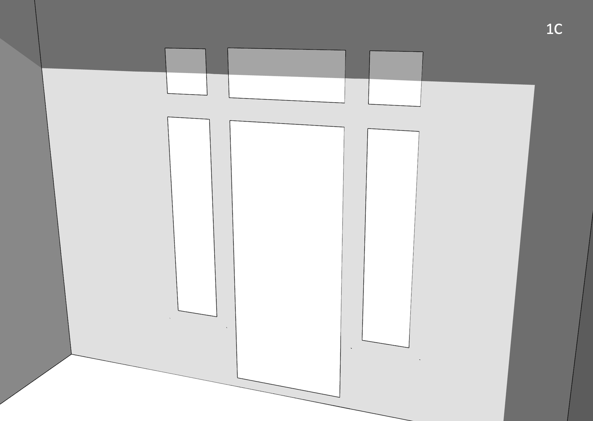
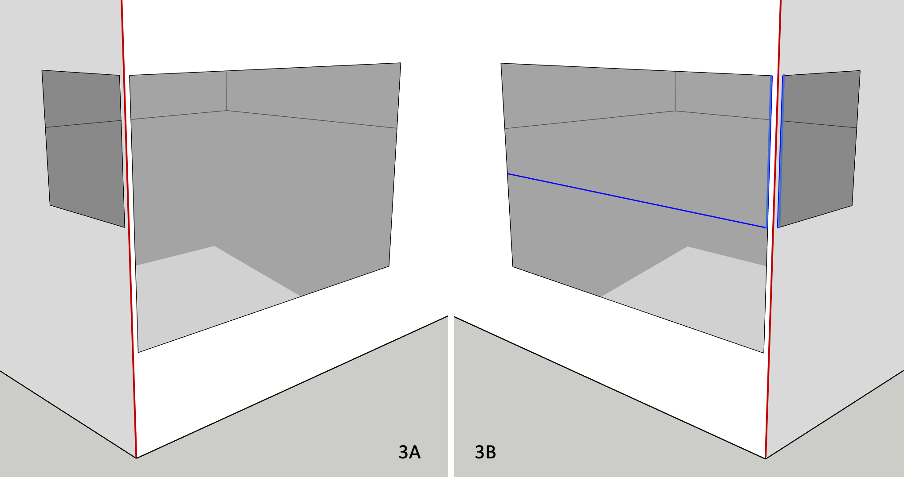

### Fenestration

There are a few things to keep in mind when it comes to fenestration. Within the scope of this Guide, we consider as _fenestration_ all _sub surfaces_ (a technical term in OpenStudio) that are added to opaque, above-grade _host_ surfaces like walls, roofs or exposed floors. This includes of course windows and skylights, but in this context also _unglazed_ products like roof hatches and opaque doors. TBD is unconcerned with the nature of individual fenestration products _per se_, but rather the __rough opening__ in the host surface required to harbour each fenestration product. Each _rough opening_ typically requires additional framing along "__sill__", "__head__" and "__jamb__" edges, with corresponding "__fenestration__" _psi_ factors.

__Figure 1A__ illustrates a residential entrance, complete with glazed door, (partial height) left and right sidelights, as well as a 3-section transom spanning the full width of the _rough opening_.

  

In OpenStudio, this 5-section entrance would be greatly simplified, and modelled as shown in __Figure 1B__.

  

- Unless modelling a _tubular daylighting device_ ([TDD](https://bigladdersoftware.com/epx/docs/22-2/input-output-reference/group-daylighting.html#daylightingdevicetubular "Tubular Daylighting Device")), a fenestrated surface must align with its host surface, i.e. they both must share the same 3D plane equation and the _sub surface_ must _fit_ within host surface boundaries.

- TBD tags fenestration edges shared with host surfaces as either "__head__", "__sill__" or "__jamb__" (depending on the situation, the door "sill" edge may later be overridden as a "grade" or "rimjoist" edge).

- "head", "sill" and "jamb" (as well as "grade" or "rimjoist") edges generally constitute major thermal bridges, _derating_ the host wall (never the _sub surface_). Compact fenestration (e.g. modest _sub surface_ perimeter-to-area ratios) minimizes thermal bridging of the host wall construction.

- TBD tags shared edges between _sub surfaces_ (highlighted in blue) as (mild) "__transitions__" - by default, no _derating_ results from such edges. It is presumed that any additional heat loss from fenestration framing would have been previously factored in the e.g. NFRC-rated fenestration U-factor.

### Frame & Dividers

OpenStudio (and EnergyPlus) users can optionally associate [frame & divider](https://bigladdersoftware.com/epx/docs/22-2/input-output-reference/group-thermal-zone-description-geometry.html#windowpropertyframeanddivider "OpenStudio Frame and Dividers") properties to most glazed _sub surfaces_. In a nutshell, this allows fenestration product frames (and dividers) to be modelled/simulated separately from glazing layers, in line with NFRC 100 rating procedures. This allows _inter alia_ a more robust assessment of fenestration aspect ratios on energy performance (e.g. 1x larger fenestration product outperforming many narrower, smaller products). OpenStudio fenestration with _frame & divider_ properties requires modelling the glazing portion ONLY of each _sub surface_ - not the _rough opening_, as illustrated in __Figure 1C__ (same entrance design).

TBD recognizes added _frame and divider_ properties in an OpenStudio model, and feeds Topolys __extended__ _sub surface_ vertices, as illustrated in __Figure 1D__. By relying on extended _sub surface_ vertices, "head", "sill" and "jamb" edges remain the same as in Figure 1B. This is also the case for "transition" edges shared between _sub surfaces_ (highlighted in blue). Note that TBD will catch (and [log](./reports.html "What TBD reports back")) invalid OpenStudio _frame & divider_ inputs that generate conflicts with either host surface boundaries or with other _sub surfaces_.

_Frame & divider_ properties allow outside and inside __reveals__ (i.e. _sub surface_ setbacks with respect to exterior and/or interior surfaces), as illustrated in Figure 1A. In such cases, TBD considers "head", "sill" and/or "jamb" _psi_ factors to account for the effect of _reveals_.

### Proximity tolerances

Shared edges between _sub surfaces_ at corners (vertical edges highlighted in blue in figures 2A, 2B and 3B) are also tagged by TBD as (mild) "transitions". Again, additional heat loss resulting from _corner mullions_ should preferably be factored in NFRC rating procedures, and thus shouldn't _derate_ host wall constructions.

By default, any _sub surface_ edge defined within 10 mm of another _sub surface_ edge, or near a host surface edge (e.g. a corner), is merged by Topolys as a single edge. TBD subsequently tags the shared edge as either a fenestration "jamb" or a "corner" edge, depending on the context. There is no difference between the application of Topolys' built-in tolerances and what's illustrated in __Figure 2A__, even if all 3x edges (2x jambs + 1x corner) aren't perfectly aligned.

When such gaps exceed Topolys' built-in tolerances (e.g. 25 mm), TBD considers (in this case) a nearby _sub surface_ edge (along a corner) as a fenestration "jamb" edge, even though a 25 mm gap between _sub_ and host surface edges makes little sense from a construction perspective. However, such gaps do occur as modelling artefacts in either legacy OpenStudio models, or in those imported from 3rd-party applications. To accommodate such cases, TBD provides users a _sub surface_ __proximity tolerance__ (see [menu options](./settings.html "TBD settings")). If, for instance, a user sets a _proximity tolerance_ of 50 mm (or rather 0.050 m), TBD ignores the aforementioned 25 mm gap and sets the 2x nearby _sub surface_ corner edges as (mild) "transitions" (illustrated in blue in __Figure 2B__).

There is little difference when _derating_ both host wall surfaces (from fenestration perimeters alone) in either figures 2A or 2B. However, there remains additional heat loss from the corner edge in Figure 2B, which continues to span the full height of both host walls. This can be corrected by adding 2x vertices along the corner edge in OpenStudio or by adjusting the corner _psi_ factor in TBD - practical, but additional steps nonetheless.

TBD matches edges this way by comparing _origin_ and _terminal_ vertices of any pair of _nearby_ edges. TBD does not apply a _proximity tolerance_ when _sub surface_ edges are mismatched as in __Figure 3A__. This can be corrected in OpenStudio by either splitting the larger window as two smaller (yet aligned) windows (which adds a new horizontal "transition" edge in blue, shown in __Figure 3B__) and/or by adding corner vertices.

### Multipliers

Similar to the use of space multipliers (a proxy for story multipliers), discussed under [tagging rules](./settings.html "TBD settings"), OpenStudio allows users to add fenestration multipliers. For instance, a single OpenStudio window (with __10x__ as a multiplier) will take less time to simulate then 10x windows. No doubt a practical feature, yet caution is warranted as it disables a number of options and casts doubt on solar and daylighting distribution within spaces. TBD processes perimeter fenestration edges (as thermal bridges), regardless of multipliers. It remains up to users to determine the pros and cons of relying on _sub surface_ multipliers in their OpenStudio models.

[HOME](../index.html "Thermal Bridging & Derating")  
