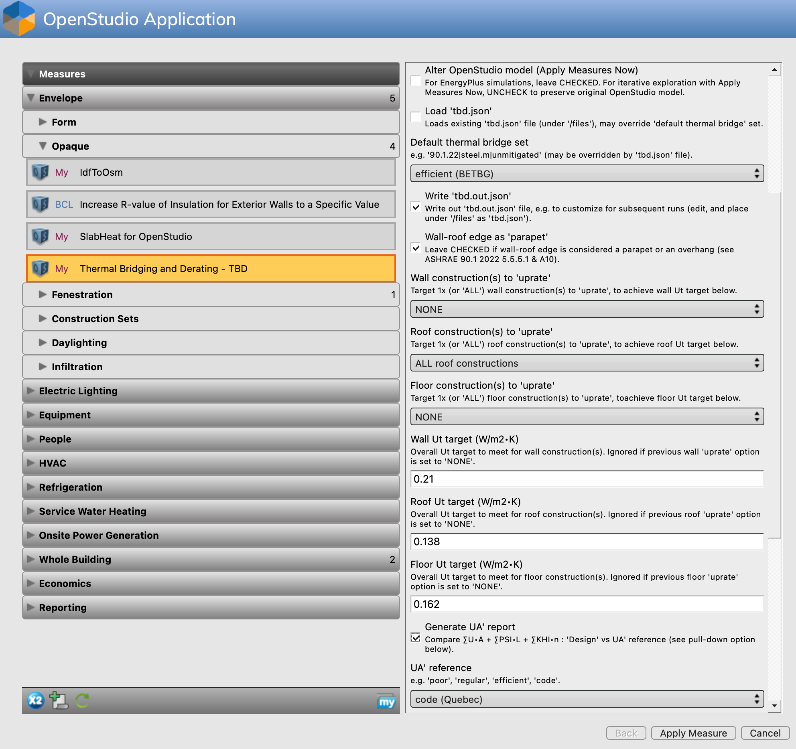

### Basics

This section goes over the _bare bones minimum_ of what's needed to run TBD as an OpenStudio _Measure_, including minimal OpenStudio model requirements, what optional inputs may be needed, and finally how to actually run the measure. Experienced OpenStudio users should feel comfortable jumping right in. Newcomers to OpenStudio are encouraged to first check out official online documentation and tutorials for [OpenStudio](https://openstudio.net "OpenStudio"), including the [OpenStudio Application](https://openstudiocoalition.org// "OpenStudio Application") - more than useful!

### Context

OpenStudio construction details and geometry are required architectural inputs for TBD. _Complete_ OpenStudio models also hold abstract variables like _thermal zones_ and schedules, as well as electrical loads, lighting and HVAC systems. TBD works just fine with _complete_ models, yet is well capable of handling _partial_ or _minimal_ OpenStudio models.

Why? Let's start by venturing that there's more than one way to approach building energy modelling. One obvious scenario is to hire competent energy modellers who take care of everything - they're specialized and very good at what they do. Yet it has its drawbacks as a _centralized_ solution. TBD works just as well within more _distributed_ approaches, where specialists may contribute to the same collective energy model, yet at different stages of the design and on different parts of the model - ideally under supervisory versioning control (just like software development). Architectural professionals should be encouraged to update and maintain geometry and construction parameters (including thermal bridging) of an OpenStudio model throughout the design process. Same goes for lighting consultants, estimators, LCA assessors, etc.

In other cases, architects may simply wish to explore whether their designs comply with certain prescriptive envelope targets, which can be efficiently ascertained using OpenStudio & TBD (and without running a single energy simulation). If they're unsuccessful in achieving e.g., [UA'](./ua.html "UA' assessments") trade-off targets, they can always seek to compensate by handing off the model to building energy modellers. For the latter, inheriting a complete _architectural_ energy model this way can be a huge time saver. This fits in well within integrated design processes, while encouraging a healthy division of labour and fair distribution of professional liability. Let's go over what TBD requires from a _minimal_ OpenStudio model.

### Minimal model requirements

__Fully enclosed geometry__: OpenStudio (and to a large extent EnergyPlus) work much better in general when a building model is _geometrically enclosed_ i.e., _air tight_ (no gaps between surfaces). This also means no unintentional surface overlaps or loosely intersecting edges, windows properly _fitting_ within the limits of their parent (or host) wall, etc. The example [warehouse](../index.html "Thermal Bridging & Derating") is a good visual of what this all means. It's worth mentioning, as some third-party design apps offer mixed results with _enclosed geometry_ when generating BIM-to-BEM models. TBD & Topolys do have some built-in tolerances (e.g. within 25 mm), but they can only do their job _well_ if vertices, edges and surfaces are well connected. Note that _partial_ OpenStudio models are not required to hold ALL building surfaces - just those that comprise the _building envelope_, in addition to interior floor surfaces. If a building has cantilevered balconies for instance, it's also a good idea to include those as _shading surfaces_ (which must _align_ with floor surfaces).

__Materials & constructions__: Geometry is not enough. TBD must also be able to retrieve referenced materials and multilayered constructions for all _envelope_ surfaces. The easiest way is via _Default Construction Sets_.

__Boundary conditions__: It's important that the OpenStudio model reflects intended exposure to surrounding environmental conditions, including which surfaces face the exterior vs the interior, the ground, etc. By default, TBD seeks only to _derate_ outdoor-facing _envelope_ walls, roofs and _exposed_ floors. Windows, doors and skylights are never _derated_. Adiabatic and ground-facing (or [KIVA](./kiva.html "KIVA support") foundation) surfaces are also never _derated_.


### Optional model requirements

TBD does require additional OpenStudio inputs _in some circumstances_. Unheated or uncooled spaces (like attics and crawlspaces) are considered _unconditioned_: their outdoor-facing surfaces aren't part of the _building envelope_, and therefore not targeted by TBD. On the other hand, outdoor-facing surfaces of _indirectly-conditioned_ spaces like plenums are considered part of the _envelope_, and therefore should be _derated_. Sections 2.3.2 to 2.3.4 [here](https://www.pnnl.gov/main/publications/external/technical_reports/PNNL-26917.pdf "90.1-2016 Performance Rating Method Reference Manual") provide a good overview of the question. Here's the underlying logic that guides TBD in such cases:

With __partial__ OpenStudio models, TBD seeks to _derate_ ALL outside-facing surfaces by positing that ALL spaces are _conditioned_, with _assumed_ setpoints of ~21°C (heating) and ~24°C (cooling) à la BETBG. This is OK for most models (even those with plenums), yet not for those with attics or crawlspaces.

If a __more complete__ OpenStudio model has one or more spaces linked to a _thermal zone_ having temperature setpoints, TBD instead seeks to only _derate_ outdoor-facing surfaces of such _conditioned_ spaces. TBD safely ignores outdoor-facing surfaces in _unconditioned_ spaces like attics and crawlspaces, yet unfortunately also those of plenums.

With a __fairly complete__ OpenStudio model (_complete_ with _thermal zones_, setpoints, and HVAC _air loops_), spaces become tagged as _indirectly-conditioned_ plenums if their _thermal zones_ actually correspond to [supply](https://bigladdersoftware.com/epx/docs/22-1/input-output-reference/group-air-path.html#airloophvacsupplyplenum "EnergyPlus supply air plenums") or [return](https://bigladdersoftware.com/epx/docs/22-1/input-output-reference/group-air-path.html#airloophvacreturnplenum "EnergyPlus return air plenums") plenums. Let's call this __case A__.

In absence of HVAC _air loops_, 2x other cases trigger a _plenum_ tag: __case B__ where the space is considered excluded from the building's _total floor area_ (an OpenStudio variable), while having its _thermal zone_ referencing an _inactive_ thermostat (i.e. can't extract valid setpoints); or finally __case C__ where the _spacetype_ name is simply set to "plenum" (case insensitive).

In summary, having TBD distinguish between _conditioned_ vs _indirectly-conditioned_ vs _unconditioned_ spaces requires a combination of the following, depending on whether attics and/or crawlspaces are found in the OpenStudio model:

- _thermal zones_
- heating/cooling setpoints  
- HVAC _air loops_

This is a __lot__ to ask of most technically proficient architects, as most items are advanced HVAC _objects_. There are OpenStudio user scripts that autogenerate _thermal zones_ from spaces (one-to-one), but it's unlikely to match what the HVAC designer has in mind (and so not always a good idea). With _unconditioned_ spaces, better off asking the HVAC engineer/modeller to complete the setup.

### TBD menu options

Whether TBD is accessed from the _OpenStudio Application_ Measures' tab, through a [CLI](https://nrel.github.io/OpenStudio-user-documentation/reference/command_line_interface/ "OpenStudio CLI") _workflow_, or as a Ruby [gem](https://rubygems.org/gems/tbd), users have access to the same __14__ menu options ("Inputs", shown here with their default values):


"JSON" input/output files, "Uprating" features, "UA'" reports and "KIVA" inputs are described in detail in the [Customization](./custom.html "TBD customization"), [Uprating](./ut.html "Uprating"), [UA'](./ua.html "UA' assessments") and [KIVA](./kiva.html "KIVA support") sections, respectively.

The __Default thermal bridge set__ pull-down menu of prepackaged, compact _psi_ sets is key for newcomers, especially in the early design stages. Users simply need to switch between default sets (and rerun the measure) to get a sense of the degree of thermal _derating_ that would take place in their building, and how this affects energy simulation results. It's easy, yet coarse as the entire building is treated uniformly (check the [Customization](./custom.html "TBD customization") section on handling multiple _psi_ sets). Each default set holds a minimal list of common thermal bridge _shorthands_ for each edge TBD identifies:
```
    "rimjoist" | wall/floor or sloped-roof/floor edge
     "parapet" | wall/roof edge
"fenestration" | window, door, skylight perimeter
      "corner" | angled wall/wall edge
     "balcony" | floor/shading edge
       "party" | adiabatic/wall (or /floor, or /roof) edge
       "grade" | slab-on-grade/foundation wall edge
       "joint" | "flat" edge that derates (e.g. roof curb)
  "transition" | "flat" edge that isn't a "joint"
```  

### Tagging rules  

When the angle between 2 _exposed_ surfaces exceeds 45° around an edge, TBD tags it either as a "__corner__" or a "__parapet__" (depending on the situation).

Instead, a _flatter_ edge shared between 2 (somewhat) parallel _exposed_ surfaces is tagged as a (mild) "__transition__". In every default _psi_ set, "transition" edges have a value of 0 W/K per meter, i.e. no _derating_ takes place. OpenStudio models can hold many such _flat_ edges, which usually do not constitute _major_ thermal bridges. For instance when they delineate plenum walls from those of the occupied space (above or below). In other cases, they're simply artifacts of third-party software e.g., tessellation. Whenever TBD is unable to clearly label an edge, it relies on "transition" as a fallback.

Some _flat_ edges aren't mild "transitions" at all, like expansion "__joints__" or roof curbs - definitely _major_ thermal bridges. Yet TBD is unable to distinguish between "transitions" and "joints" from OpenStudio geometry alone. The [Customization](./custom.html "TBD customization") section shows users how to reset "transition" edges into "joints" when needed.

TBD considers an edge as delineating a demising (or "__party__") partition, when it links:  

- a single _exposed_ surface
- another surface referencing an [OtherSideCoefficients](https://bigladdersoftware.com/epx/docs/22-2/input-output-reference/group-advanced-surface-concepts.html#surfacepropertyothersidecoefficients) object  

If this second surface instead faces adiabatic conditions or references itself (solutions more suitable for space or story multipliers), TBD maintains a "transition" tag (which can always be customized if needed).

### Multiple tags?

What happens when an edge can be tagged with more than one label? For instance when an edge is shared between wall, door (sill), floor and balcony? TBD ultimately labels the edge according to the _psi_ factor that represents the greatest heat loss. So if the "fenestration" and "rimjoist" _psi_ factors are 0.5 W/K per meter, yet the "balcony" _psi_ factor is 0.8 W/K per meter, then the edge is tagged as a "balcony" thermal bridge. Such TBD rules are described in finer detail in the source code itself, which is publicly accessible and well documented: check for Ruby (.rb) files under the /lib folder of the TBD GitHub repository.

### Where does one get _psi_ data?

The [BETBG](https://www.bchydro.com/powersmart/business/programs/new-construction.html "Building Envelope Thermal Bridging Guide") & [thermalenvelope.ca](https://thermalenvelope.ca) collections are great resources to start with. They rely in part on past research initiatives, like ASHRAE's RP-1365 (which is also great), and are regularly updated. Building energy codes and ISO standards are also relevant resources. TBD relies on all of these for its built-in _psi_ sets (values in W/K per meter):

__poor (BETBG)__
```
    rimjoist | 1.000
     parapet | 0.800
fenestration | 0.500
      corner | 0.850
     balcony | 1.000
       party | 0.850
       grade | 0.850
       joint | 0.300
```
__regular (BETBG)__
```
    rimjoist | 0.500
     parapet | 0.450
fenestration | 0.350
      corner | 0.450
     balcony | 0.500
       party | 0.450
       grade | 0.450
       joint | 0.200
```
__efficient (BETBG)__
```
    rimjoist | 0.200
     parapet | 0.200
fenestration | 0.200
      corner | 0.200
     balcony | 0.200
       party | 0.200
       grade | 0.200
       joint | 0.100
```
__spandrel (BETBG)__
```
    rimjoist | 0.615
     parapet | 1.000
fenestration | 0.000
      corner | 0.425
     balcony | 1.110
       party | 0.990
       grade | 0.880
       joint | 0.500
```
__spandrel HP (BETBG)__
```
    rimjoist | 0.170
     parapet | 0.660
fenestration | 0.000
      corner | 0.200
     balcony | 0.400
       party | 0.500
       grade | 0.880
       joint | 0.140
```
__code (Québec)__
```
    rimjoist | 0.300
     parapet | 0.325
fenestration | 0.200
      corner | 0.300
     balcony | 0.500
       party | 0.450
       grade | 0.450
       joint | 0.200
```
__uncompliant (Québec)__
```
    rimjoist | 0.850
     parapet | 0.800
fenestration | 0.500
      corner | 0.850
     balcony | 1.000
       party | 0.850
       grade | 0.850
       joint | 0.500
```  

The "poor", "regular" and "efficient" sets mirror those of the BETBG (laid out at the beginning of the document). They provide ballpark figures of _bottom-of-the-barrel_ vs _high-performance_ technologies. The basic vs high-performance (HP) "spandrel" sets offer a range of expected values for curtain/window wall technologies (also from the BETBG).

TBD provides support for the Québec building energy "code", which holds explicit requirements on _major_ thermal bridging (similar to ASHRAE 90.1 2019 [Addendum av](https://www.ashrae.org/file%20library/technical%20resources/standards%20and%20guidelines/standards%20addenda/90_1_2019_av_20220729.pdf)). When Québec professionals are unable to determine whether they comply to prescriptive requirements or are unsure what _psi_ factors to use, they can fall back (entirely or partly) on the "uncompliant" set. Note that the parapet and corner values here may need to be corrected for exterior dimensioning of energy models, as per code requirements (see "A side note on dimensioning" at the end of the [Customization](./custom.html "TBD customization") section).

Finally, there is also a "(non thermal bridging)" set where all _psi_ factors are fixed at 0 W/K per meter - mainly used for quality control and debugging, but also key when autogenerating KIVA inputs (see _Apply Measures Now_ below).

### EnergyPlus simulations

OpenStudio users need to specify where downloaded _measures_ are stored on their workstation (_Preferences_ > _Change My Measures Directory_) - just download TBD in there (click on the _download_ links at the top of the page, or download from GitHub or [BCL](https://bcl.nrel.gov/dashboard "OpenStudio's Building Component Library") - search for "tbd" or "rd2"). Then in the _OpenStudio Application_, simply drag & drop TBD in the _Measures_ tab.

As with most OpenStudio measures, TBD does not modify the original OpenStudio building model (e.g. adding/referencing new _derated_ constructions). OpenStudio makes a behind-the-scenes copy of the model, which is in turn modified before simulation. Although the terminology may be at first confusing, leave the __Alter OpenStudio model__ option CHECKED for EnergyPlus simulations - this option is really there for _Apply Measures Now_ cases. Once the __Default thermal bridge set__ is selected, save the model and run the simulation.

Results should show an increase in heating loads for cold climates. For ASHRAE climate zone 7, annual heating should increase generally between 5% to 15% (depending on the building type) for "poor" to "regular" thermal bridging details in an otherwise well-insulated envelope. Consult the [Reporting](./reports.html "What TBD reports back") section to learn more on TBD feedback.

### Apply Measures Now

The original intent of an _Apply Measures Now_ feature in OpenStudio is to irreversibly alter a building model without the need to run an EnergyPlus simulation. For instance, the [KIVA](./kiva.html "KIVA support") options in TBD work best in _Apply Measures Now_ mode: best leave the __Alter OpenStudio model__ option CHECKED in such cases, while ideally relying on the default "(non thermal bridging)" set.

However, there are _Apply Measures Now_ situations where permanent changes to an OpenStudio model aren't warranted or desirable, in which case it becomes critical to UNCHECK the __Alter OpenStudio model__ option:

- __Iterative investigations__: Users may simply want to get a status report of how well they're managing thermal bridging in their projects. TBD provides the same user feedback (including errors & warnings) in either mode. Consult the [Reporting](./reports.html "What TBD reports back") section.

- __UA' reports__: Similarly, TBD can generate at any moment [UA'](./ua.html "UA' assessments") summaries (often admissible building energy code compliance paths). Same for [uprating](./ut.html "Uprating") features.

- __JSON output__: Users can generate a complete, detailed list of every _major_ thermal bridge in their OpenStudio model, which can be useful for automating cost estimation or simply for further [customization](./custom.html "TBD customization").

An example of _Apply Measures Now_ interaction:



Here, _Apply Measures Now_ will generate a __UA'__ report (MD-formatted), as well as a _full_ __JSON__ output file - complete with all the edges, UA' summaries, logs, etc. Note that this _snapshot_ will NOT __alter__ the OpenStudio model - the first menu option here remains UNCHECKED. Clicking on `Apply Measure` ...


If unsatisfied with the results (e.g., too costly to comply to NECB2017 prescriptive roof requirements, wall detailing may need to be revised), then the user simply needs to `Back` out, and tweak inputs again, then re-`Apply Measure`, reassess, and so on ... Once satisfied with a _winning_ combination of variables, press `Accept Changes`, then `save` the OpenStudio model to retrieve the newly-generated __UA'__ and __JSON__ files (see [Reporting](./reports.html "What TBD reports back") to locate saved files). Take note of the _winning_ combination of inputs - you'll need to reapply these for EnergyPlus simulations.

__A word of caution__. Currently, OpenStudio will NOT copy over such `.md` or `.json` files generated by _Apply Measures Now_ ... __if__ these files already exist in the model _files_ folder. This will likely be corrected in the near future. In the meantime, simply rename or delete the existing files before opening the OpenStudio model.

[BACK](../index.html "Thermal Bridging & Derating")  
