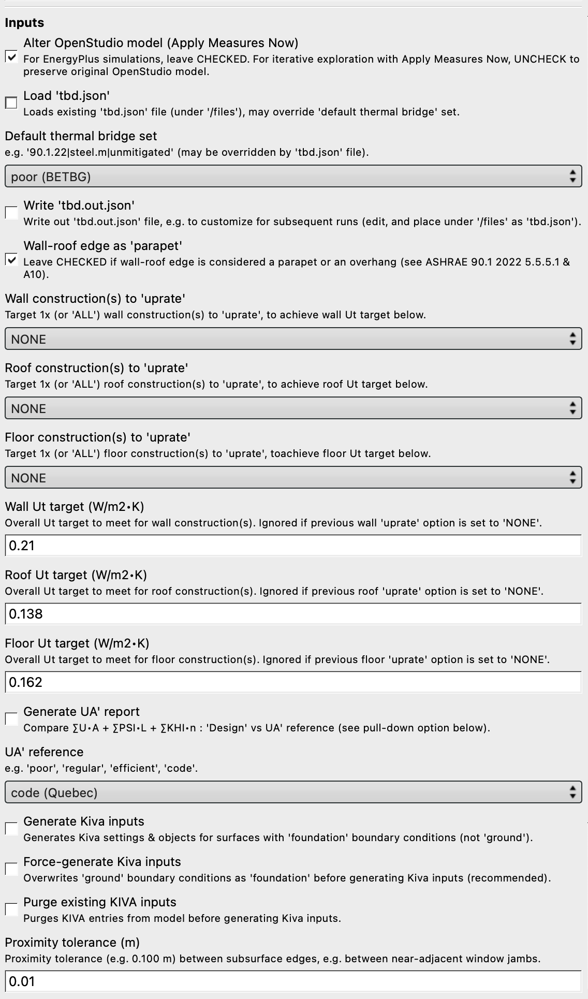

### Settings

This section goes over the _bare bones minimum_ of what's needed to run TBD as an OpenStudio _Measure_, including minimal OpenStudio model requirements, optional OpenStudio _space conditioning_ inputs, and finally TBD menu options. Experienced OpenStudio users should feel comfortable jumping right in. Newcomers to OpenStudio are encouraged to first check out official online documentation and tutorials for [OpenStudio](https://openstudio.net "OpenStudio"), including the [OpenStudio Application](https://openstudiocoalition.org// "OpenStudio Application") - more than useful!

### [Context](#context)

OpenStudio construction details and geometry are required architectural inputs for TBD. _Complete_ OpenStudio models also hold abstract variables like _thermal zones_ and schedules, as well as electrical loads, lighting and HVAC systems. TBD works just fine with _complete_ models, yet can also generate useful design feedback and metrics from _intermediate_ or _partial_ OpenStudio models.

Why? Let's start by venturing that there's more than one way to approach building energy modelling. One obvious scenario is to hire competent energy modellers who take care of everything - they're specialized and very good at what they do. Yet it has its drawbacks as a _centralized_ solution. TBD works just as well within more _distributed_ approaches, where specialists may contribute to the same collective energy model, yet on different parts (and at different design stages); ideally under supervisory versioning control (just like software development). Architectural professionals should be encouraged in maintaining geometry and construction parameters (including thermal bridging) of an OpenStudio model throughout the design process. Same goes for lighting consultants, estimators, LCA assessors, etc.

In other cases, architects may simply wish to explore whether their designs comply with certain prescriptive envelope targets, which can be efficiently ascertained using OpenStudio & TBD (without having to run a single energy simulation). If they're unsuccessful in achieving for instance [UA'](./ua.html#assessments "UA' assessments") trade-off targets, they can always seek to compensate by handing off the model to building energy modellers. For the latter, inheriting complete (and valid) _architectural_ energy models this way can be a huge time saver. This fits in well within integrated design processes, while encouraging a healthy division of labour and fair distribution of professional liability. Let's go over what TBD requires from a _minimal_ OpenStudio model.

### [Minimal model requirements](#minimal-model-requirements)

__Fully enclosed geometry__: OpenStudio (and to a large extent EnergyPlus) work much better with _geometrically enclosed_ models. This means no gaps between surfaces, no unintentional surface overlaps, no loosely intersecting edges, windows that properly fit within the limits of their parent (or _base_) wall, and so on. The example [warehouse](../index.html#warehouse "Thermal Bridging & Derating") is a good visual of what this all means. It's worth underlining, as third-party design apps offer mixed results with _enclosed geometry_ when generating BIM-to-BEM models. Despite built-in tolerances, TBD and Topolys can only do their job well if vertices, edges and surfaces are properly connected. Note that _partial_ OpenStudio models are not required to hold ALL building surfaces - just those that comprise the _building envelope_, in addition to interior floor surfaces. If a building has cantilevered balconies for instance, it's also a good idea to include those as _shading surfaces_ (which must _align_ with floor surfaces for TBD to autodetect).

__Materials & constructions__: Geometry is not enough. TBD must also retrieve referenced materials and multilayered constructions for all _envelope_ surfaces. The easiest way is via _Default Construction Sets_.

__Boundary conditions__: It's important that the OpenStudio model reflects intended exposure to surrounding environmental conditions, including which surfaces face the exterior vs the interior, the ground, etc. TBD _derates_ envelope walls, roofs and _exposed_ floors. Windows, doors and skylights are never _derated_. Adiabatic and ground-facing (or [KIVA](./kiva.html "KIVA support") foundation) surfaces are also never _derated_.

### [Space conditioning](#space-conditioning)

TBD does require additional OpenStudio inputs _in some circumstances_. Spaces neither heated nor cooled (like attics and crawlspaces) are considered _unconditioned_: their outdoor-facing surfaces aren't part of the _building envelope_, and therefore not targeted by TBD. On the other hand, outdoor-facing surfaces of _indirectly-conditioned_ spaces (like plenums) are considered part of the _building envelope_, and therefore _derated_.  Here's the underlying logic that guides TBD:

With __partial__ OpenStudio models (no _thermal zones_, no setpoints), TBD _derates_ ALL outdoor-facing surfaces by positing that ALL spaces are _conditioned_, with _assumed_ setpoints of ~21°C (heating) and ~24°C (cooling) à la BETBG. This is OK for most models (even those with plenums), yet not for those with attics or crawlspaces.

If an __intermediate__ OpenStudio model holds at least one space linked to a _thermal zone_ having temperature setpoints, TBD instead _derates_ envelope surfaces of _conditioned_ spaces only. TBD safely ignores outdoor-facing surfaces of _unconditioned_ spaces (like attics and crawlspaces), yet unfortunately also those of _indirectly-conditioned_ spaces like plenums.

With __complete__ OpenStudio models, TBD relies on the `setpoint` method of one of its dependencies, [OSut](https://github.com/rd2/osut), to determine the space conditioning status of _unoccupied_ rooms (like _plenums_) and other _indirectly-conditioned_ spaces.

_Sections 2.3.2 to 2.3.4 of this PNNL [report](https://www.pnnl.gov/main/publications/external/technical_reports/PNNL-26917.pdf "90.1-2016 Performance Rating Method Reference Manual") provide a good overview of space conditioning classification._

### [TBD menu options](#tbd-menu-options)

Whether TBD is accessed from the _OpenStudio Application_ Measures' tab, through a [CLI](https://nrel.github.io/OpenStudio-user-documentation/reference/command_line_interface/ "OpenStudio CLI") _workflow_, or as a Ruby [gem](https://rubygems.org/gems/tbd), users have access to the same __17__ menu options ("Inputs", shown here with their default values):



_The following menu options are described elsewhere: [Proximity tolerance](./subs.html#proximity-tolerances "TBD fenestration options"), [JSON](./custom.html "TBD customization") input/output files, [Uprating](./ut.html "Uprating") features, [UA'](./ua.html#assessments "UA' assessments") reports and [KIVA](./kiva.html "KIVA support")._

The __Default thermal bridge set__ pull-down menu of built-in _psi_ factors is often handy for newcomers, especially in the early design stages. Users can simply switch between default sets (and rerun the measure) to get a sense of how thermal bridging may affect energy simulation results. It's easy, yet coarse as the entire building is treated uniformly (check the [Customization](./custom.html#managing-multiple-custom-psi-factor-sets "TBD customization") section on associating specific _psi_ factors to different construction sets in a building). Each default set holds a list of common thermal bridge _shorthands_ for each edge TBD identifies:  
```
       "rimjoist" | intermediate floor/wall (or /sloped-roof) edge
        "parapet" | roof/wall parapet edge
           "roof" | (non-parapet) roof/wall edge
        "ceiling" | between e.g. unoccupied plenum vs occupied space
   "fenestration" | vertical fenestration perimeter (e.g. glazed door)
           "door" | opaque door perimeter
       "skylight" | skylight perimeter
       "spandrel" | opaque wall/spandrel edge
         "corner" | angled wall/wall edge
        "balcony" | floor/shading edge
    "balconysill" | floor/shading/fenestration edge
"balconydoorsill" | floor/shading/opaque door edge
          "party" | demising wall (or floor, or roof) edge
          "grade" | slab-on-grade/foundation wall edge
          "joint" | "flat" edge that derates (e.g. expansion joint)
     "transition" | "flat" edge that isn't a "joint"
```  
Users can switch from "__parapet__" to "__roof__" _psi_ factors in a given set (as required by ASHRAE 90.1 2022), by unchecking the "_Wall-roof edge as 'parapet'_" box.

### [Tagging rules](#tagging-rules)

When the angle between 2 _exposed_ surfaces exceeds 45° around an edge, TBD tags it either as a "__corner__" or a "__parapet__" (or a "__roof__"), depending on the situation. A _flatter_ edge shared between 2 (somewhat) parallel _exposed_ surfaces is instead tagged as a (mild) "__transition__".  OpenStudio models can hold many such _flat_ edges, which usually do not constitute _major_ thermal bridges (e.g. outcome of 3rd-party software tessellation). Every built-in set holds a "transition" _psi_ factor of 0 W/K per meter. Whenever TBD is unable to clearly label an edge, it relies on "transition" as a fallback.

Some _flat_ edges aren't mild "transitions" at all, like "__spandrel__" panel perimeters or expansion "__joints__" - definitely _major_ thermal bridges. "Spandrel" edges along a neighbouring, non-spandrel wall surface are autodetected based on [OSut](https://github.com/rd2/osut)'s `spandrel?` method. Yet in other cases (like expansion "joints"), TBD is unable to distinguish between "transition" and "joint" from OpenStudio geometry alone. The [Customization](./custom.html#custom-edges "TBD customization") section illustrates how to reset "transition" edges into "joints" when needed.

TBD considers an edge as delineating a demising (or "__party__") partition, when it links both:  

- a single _exposed_ surface
- another surface referencing an [OtherSideCoefficients](https://bigladdersoftware.com/epx/docs/24-1/input-output-reference/group-advanced-surface-concepts.html#surfacepropertyothersidecoefficients) object  

If the latter instead faces adiabatic conditions or references _itself_ (often used in conjunction with space multipliers), TBD usually maintains a "transition" tag (which can also be [reset](./custom.html "TBD customization") if needed). In the 5-story building illustrated below, only 3 stories would need to be modelled (saving on simulation run times), as long as the intermediate story holds spaces and loads with multipliers (here, __3x__). Two groups of surfaces would need to be modelled as adiabatic:  

- ground-level & intermediate level "ceilings"
- top-level & intermediate level "floors"

  

Adiabatic ceilings are coloured here in pale green, while their perimeter "transition" edges are highlighted in blue. Edges along floor slab perimeters are maintained as "rimjoist" (or "grade") thermal bridges, _derating_ only connected walls above (not those below). This redistribution of "rimjoists" heat loss certainly changes surface-specific thermal bridging tallies, but building-wide tallies remain the same.

Finally, perimeter edges of a suspended ceiling, typically separating an unoccupied (_indirectly-conditioned_) return air plenum from occupied (_directly-conditioned_) spaces below, are tagged as "__ceiling__" edges. They are differentiated from "roof" or "parapet" edges in that they typically do not consitute _major_ thermal bridges (all built-in _psi_ factor sets have "__ceiling__" values of 0 W/K per meter). These can also be customized for less common cases (e.g. underfloor supply air plenums).

### [Multiple tags](#multiple-tags)?

What happens when an edge can be tagged with more than one label? For instance when an edge is shared between wall, door sill, intermediate floor, and balcony? Deterministic sorting is applied in most cases. Here, the edge is tagged as either "rimjoist", "balcony", "balconysill" or "balconydoorsill", based on (true/false):

- attached balcony?
- along sill of _vertical fenestration_ (e.g. glass door)?
- along sill of an _opaque door_?  

What happens if glazed doors aren't along a balcony (like French doors)? When sorting rules aren't as clear, TBD labels an edge according to the candidate _psi_ factor that represents the greatest heat loss. Consider a skylight aligned along a roof parapet. Both "skylight" and "parapet" edge types _could_ apply. Yet if the skylight _psi_ factor were 0.5 W/K per meter, while the "parapet" _psi_ factor 0.8 W/K per meter, then the edge is tagged as a "parapet" thermal bridge. Such TBD rules are described in finer detail in the source code itself, which is publicly accessible and well documented: check for Ruby (.rb) files under the /lib folder of the TBD GitHub repository.

### [Where does one get _psi_ data](#where-does-one-get-psi-data)?

The [BETBG](https://www.bchydro.com/powersmart/business/programs/new-construction.html "Building Envelope Thermal Bridging Guide") & [thermalenvelope.ca](https://thermalenvelope.ca) collections are great resources to start with. They rely in part on past research initiatives, like ASHRAE's RP-1365 (which is also great), and are regularly updated. Building energy codes like ASHRAE 90.1 2022 and ISO standards are also relevant resources. TBD relies on all of these for its built-in _psi_ factor sets (values in W/K per meter):

__poor (BETBG)__  
```
       rimjoist | 1.000000
        parapet | 0.800000
           roof | 0.800000
        ceiling | 0.000000
   fenestration | 0.500000
           door | 0.500000
       skylight | 0.500000
       spandrel | 0.155000
         corner | 0.850000
        balcony | 1.000000
    balconysill | 1.000000
balconydoorsill | 1.000000
          party | 0.850000
          grade | 0.850000
          joint | 0.300000
```
__regular (BETBG)__  
```
       rimjoist | 0.500000
        parapet | 0.450000
           roof | 0.450000
        ceiling | 0.000000
   fenestration | 0.350000
           door | 0.350000
       skylight | 0.350000
       spandrel | 0.155000
         corner | 0.450000
        balcony | 0.500000
    balconysill | 0.500000
balconydoorsill | 0.500000
          party | 0.450000
          grade | 0.450000
          joint | 0.200000
```
__efficient (BETBG)__  
```
       rimjoist | 0.200000
        parapet | 0.200000
           roof | 0.200000
        ceiling | 0.000000
   fenestration | 0.199999
           door | 0.199999
       skylight | 0.199999
       spandrel | 0.155000
         corner | 0.200000
        balcony | 0.200000
    balconysill | 0.200000
balconydoorsill | 0.200000
          party | 0.200000
          grade | 0.200000
          joint | 0.100000
```
__spandrel (BETBG)__  
```
       rimjoist | 0.615000
        parapet | 1.000000
           roof | 1.000000
        ceiling | 0.000000
   fenestration | 0.000000
           door | 0.000000
       skylight | 0.350000
       spandrel | 0.155000
         corner | 0.425000
        balcony | 1.110000
    balconysill | 1.110000
balconydoorsill | 1.110000
          party | 0.990000
          grade | 0.880000
          joint | 0.500000
```
__spandrel HP (BETBG)__  
```
       rimjoist | 0.170000
        parapet | 0.660000
           roof | 0.660000
        ceiling | 0.000000
   fenestration | 0.000000
           door | 0.000000
       skylight | 0.350000
       spandrel | 0.155000
         corner | 0.200000
        balcony | 0.400000
    balconysill | 0.400000
balconydoorsill | 0.400000
          party | 0.500000
          grade | 0.880000
          joint | 0.140000
```
__code (Québec)__  
```
       rimjoist | 0.300000
        parapet | 0.325000
           roof | 0.325000
        ceiling | 0.000000
   fenestration | 0.200000
           door | 0.200000
       skylight | 0.200000
       spandrel | 0.155000
         corner | 0.300000
        balcony | 0.500000
    balconysill | 0.500000
balconydoorsill | 0.500000
          party | 0.450000
          grade | 0.450000
          joint | 0.200000
```
__uncompliant (Québec)__  
```
       rimjoist | 0.850000
        parapet | 0.800000
           roof | 0.800000
        ceiling | 0.000000
   fenestration | 0.500000
           door | 0.500000
       skylight | 0.500000
       spandrel | 0.155000
         corner | 0.850000
        balcony | 1.000000
    balconysill | 1.000000
balconydoorsill | 1.000000
          party | 0.850000
          grade | 0.850000
          joint | 0.500000
```  
__90.1.22|steel.m|default__  
```
       rimjoist | 0.307000
        parapet | 0.260000
           roof | 0.020000
        ceiling | 0.000000
   fenestration | 0.194000
           door | 0.000000
       skylight | 0.000000
       spandrel | 0.000001
         corner | 0.000002
        balcony | 0.307000
    balconysill | 0.307000
balconydoorsill | 0.307000
          party | 0.000001
          grade | 0.000001
          joint | 0.376000
```  
__90.1.22|steel.m|unmitigated__  
```
       rimjoist | 0.842000
        parapet | 0.500000
           roof | 0.650000
        ceiling | 0.000000
   fenestration | 0.505000
           door | 0.000000
       skylight | 0.000000
       spandrel | 0.000001
         corner | 0.000002
        balcony | 0.842000
    balconysill | 1.686000
balconydoorsill | 0.842000
          party | 0.000001
          grade | 0.000001
          joint | 0.554000
```  
__90.1.22|mass.ex|default__  
```
       rimjoist | 0.205000
        parapet | 0.217000
           roof | 0.150000
        ceiling | 0.000000
   fenestration | 0.226000
           door | 0.000000
       skylight | 0.000000
       spandrel | 0.000001
         corner | 0.000002
        balcony | 0.205000
    balconysill | 0.307000
balconydoorsill | 0.205000
          party | 0.000001
          grade | 0.000001
          joint | 0.322000
```  
__90.1.22|mass.ex|unmitigated__  
```
       rimjoist | 0.824000
        parapet | 0.412000
           roof | 0.750000
        ceiling | 0.000000
   fenestration | 0.325000
           door | 0.000000
       skylight | 0.000000
       spandrel | 0.000001
         corner | 0.000002
        balcony | 0.824000
    balconysill | 1.686000
balconydoorsill | 0.824000
          party | 0.000001
          grade | 0.000001
          joint | 0.476000
```  
__90.1.22|mass.in|default__  
```
       rimjoist | 0.495000
        parapet | 0.393000
           roof | 0.150000
        ceiling | 0.000000
   fenestration | 0.143000
           door | 0.000000
       skylight | 0.000000
       spandrel | 0.000000
         corner | 0.000001
        balcony | 0.495000
    balconysill | 0.307000
balconydoorsill | 0.495000
          party | 0.000001
          grade | 0.000001
          joint | 0.322000
```  
__90.1.22|mass.in|unmitigated__  
```
       rimjoist | 0.824000
        parapet | 0.884000
           roof | 0.750000
        ceiling | 0.000000
   fenestration | 0.543000
           door | 0.000000
       skylight | 0.000000
       spandrel | 0.000000
         corner | 0.000001
        balcony | 0.824000
    balconysill | 1.686000
balconydoorsill | 0.824000
          party | 0.000001
          grade | 0.000001
          joint | 0.476000
```  
__90.1.22|wood.fr|default__  
```
       rimjoist | 0.084000
        parapet | 0.056000
           roof | 0.020000
        ceiling | 0.000000
   fenestration | 0.171000
           door | 0.000000
       skylight | 0.000000
       spandrel | 0.000000
         corner | 0.000001
        balcony | 0.084000
    balconysill | 0.171001
balconydoorsill | 0.084000
          party | 0.000001
          grade | 0.000001
          joint | 0.074000
```  
__"90.1.22|wood.fr|unmitigated"__  
```
       rimjoist | 0.582000
        parapet | 0.056000
           roof | 0.150000
        ceiling | 0.000000
   fenestration | 0.260000
           door | 0.000000
       skylight | 0.000000
       spandrel | 0.000000
         corner | 0.000001
        balcony | 0.582000
    balconysill | 0.582000
balconydoorsill | 0.582000
          party | 0.000001
          grade | 0.000001
          joint | 0.322000
```  
The "__poor__", "__regular__" and "__efficient__" sets mirror those of the BETBG (laid out at the beginning of that document). They provide ballpark figures of _bottom-of-the-barrel_ vs _high-performance_ technologies. The basic vs high-performance (HP) "__spandrel__" sets provide a range of expected values for curtain/window wall technologies (also from the BETBG).

TBD supports the Québec building energy "__code__", which holds explicit requirements on _major_ thermal bridging. When Québec professionals are unable to determine whether they comply to prescriptive requirements or are unsure which _psi_ factors to use, they can fall back (entirely or partly) on the "__uncompliant__" set. Note that the "parapet" and "corner" values here may need to be corrected for [exterior dimensioning](./custom.html#a-side-note-on-dimensioning "TBD customization") of energy models, as per code requirements.

ASHRAE "__90.1 2022__" (Table A10.1) _default_ (_unmitigated_) and _unmitigated_ sets are also included. Many edge types (like "corner", "grade" and "door") are unlisted in Table A10.1. Omitted edge types are addressed in requirement 5.5.5.5, which unfortunately cannot be easily automated. TBD nonetheless tracks omitted edges, while setting their _psi_ factors to 0 W/K per meter (for both _mitigated_ and corresponding _unmitigated_ sets). Users can recover unlisted edges from the _tbd.out.json_ output file (see [Reporting](./reports.html "What TBD reports back")) for relevant 5.5.5.5 side calculations.

Some ASHRAE _psi_ factors are off by 1/100,000 of published values (e.g. "grade" at 0.000,001 W/K per meter, rather than 0). These slight adjustments provide deterministic sorting by prioritizing edge types ("grade" over "door"), when 2 or more applicable edge types have _psi_ factors of 0 W/K per meter. Incrementing a _psi_ factor by 1/100,000 has no effect on simulation results.

Finally, there is also a "(__non thermal bridging__)" set where all _psi_ factors are fixed at 0 W/K per meter - mainly used for quality control and debugging, but also key when autogenerating KIVA inputs or UA' reports (see [Apply Measures Now](./launch.html#apply-measures-now "Launching TBD as a process")).  

[HOME](../index.html "Thermal Bridging & Derating")  
