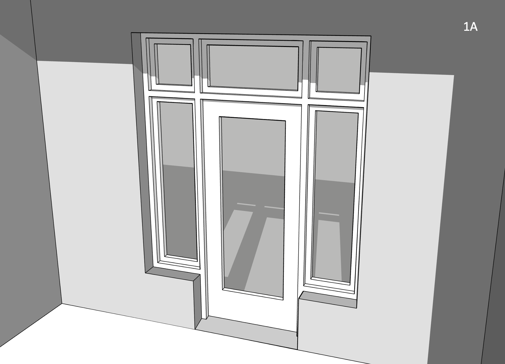
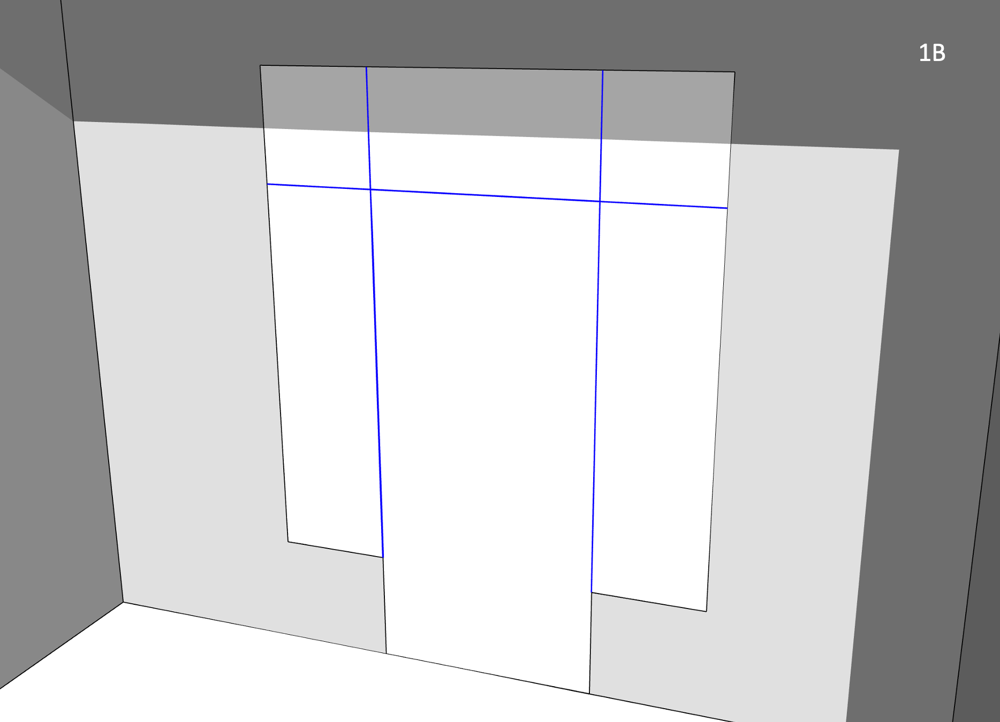
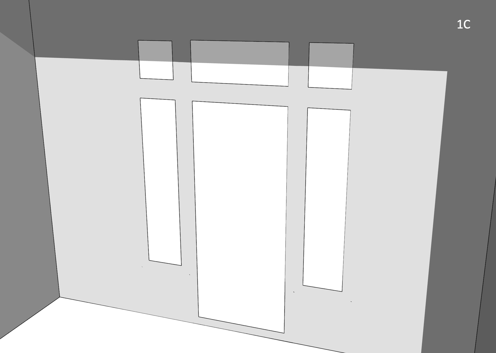
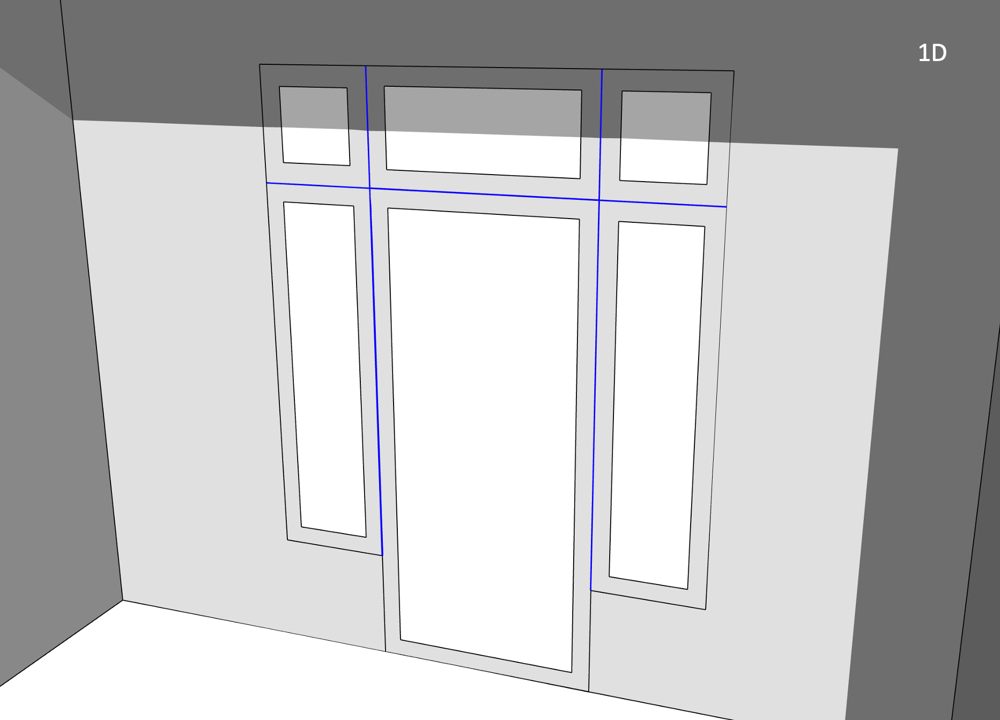
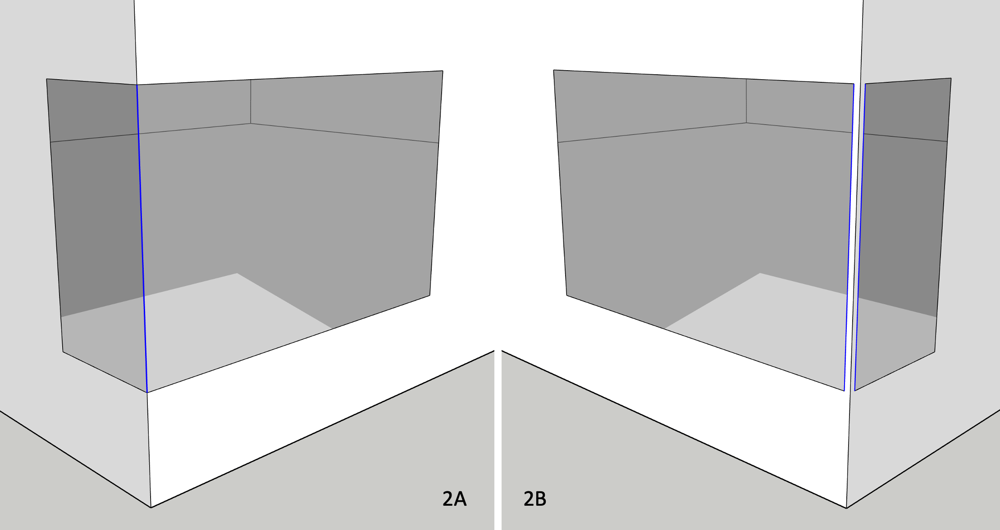
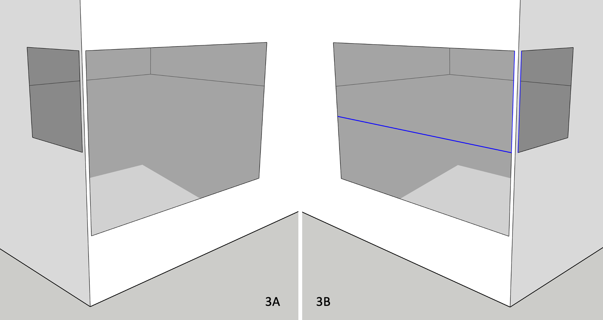

### Fenestration

There are a few things to keep in mind when it comes to fenestration. Within the scope of this Guide, we consider as _fenestration_ all _sub surfaces_ (a technical term in OpenStudio) that are added to opaque, above-grade _host_ surfaces like walls, roofs or exposed floors. This includes of course windows and skylights, but in this context also _unglazed_ products like roof hatches and opaque doors. TBD is unconcerned with the nature of individual fenestration products _per se_, but rather the __rough opening__ (in the host surface) required to harbour each fenestration product. Each _rough opening_ typically requires additional framing along "__sill__", "__head__" and "__jamb__" edges, with corresponding "__fenestration__" _psi_ factors.

__Figure 1A__ illustrates a residential entrance, complete with glazed door, (partial height) left and right sidelights, as well as a 3-section transom spanning the full width of the _rough opening_.

  

In OpenStudio, this 5-section entrance would be greatly simplified, and modelled as shown in __Figure 1B__.

  

- Unless modelling a _tubular daylighting device_ ([TDD](https://bigladdersoftware.com/epx/docs/22-2/input-output-reference/group-daylighting.html#daylightingdevicetubular "Tubular Daylighting Device")), a fenestrated surface must _align_ with its host surface, i.e. they both must share the same 3D plane equation and the _sub surface_ must _fit_ within host surface boundaries.

- TBD tags fenestration perimeter edges (shared with its host surface) as either "__head__", "__sill__" or "__jamb__" (depending on the situation, the door "sill" edge may later be overridden as a "grade" or "rimjoist" edge).

- "head", "sill" and "jamb" (as well as "grade" or "rimjoist") edges generally constitute major thermal bridges, _derating_ the host wall (never the _sub surface_). Compact fenestration (e.g. modest _sub surface_ perimeter-to-area ratios) minimizes thermal bridging of the host wall construction.

- TBD tags _shared_ edges __between__ _sub surfaces_ (highlighted in blue) as (mild) "__transitions__" - by default, no _derating_ results from such edges. It is presumed that any additional heat loss from fenestration framing (shared between _sub surfaces_ or along perimeter edges) would be factored in e.g. the NFRC-rated fenestration U-factor.

### Frame & Dividers

OpenStudio (and EnergyPlus) users can optionally associate [frame & divider](https://bigladdersoftware.com/epx/docs/22-2/input-output-reference/group-thermal-zone-description-geometry.html#windowpropertyframeanddivider "OpenStudio Frame and Dividers") properties to most glazed _sub surfaces_. In a nutshell, this allows fenestration product frames (and dividers) to be modelled/simulated separately from glazing layers, in line with NFRC 100 rating procedures. This allows _inter alia_ a more robust assessment of fenestration aspect ratios on energy performance (e.g. 1x larger fenestration product outperforming many narrower, smaller products). OpenStudio fenestration, with _frame & divider_ properties, requires 3D modelling of the glazing portion ONLY of each _sub surface_ - not the _rough opening_, as illustrated in __Figure 1C__ (same entrance design).

TBD recognizes added _frame and divider_ properties in an OpenStudio model, and feeds Topolys __offset__ _sub surface_ vertices, as illustrated in __Figure 1D__. By relying on offset _sub surface_ vertices, "head", "sill" and "jamb" edges remain the same as in Figure 1B. This is also the case for "transition" edges shared between _sub surfaces_ (highlighted in blue). So added _frame and divider_ properties will not generate issues for TBD. Note however that TBD will catch (and [log](./reports.html "What TBD reports back")) invalid OpenStudio _frame & divider_ inputs that generate conflicts with either host surface boundaries or with other _sub surfaces_.

_Frame & divider_ properties also allow outside and inside __reveals__ (i.e. _sub surface_ setbacks with respect to exterior and/or interior surfaces), as illustrated in Figure 1A. In such cases, TBD considers "head", "sill" and/or "jamb" _psi_ factors to account for the effect of _reveals_.

### Proximity tolerances

A shared edge between two _sub surfaces_ at a corner (e.g. the single vertical edge highlighted in blue in __Figure 2A__) is also tagged by TBD as a (mild) "transition". Again, any additional heat loss resulting from _corner mullions_ should preferably be factored in NFRC fenestration rating procedures, and thus shouldn't _derate_ host wall constructions.  

In Figure 2A, Topolys _breaks_ its own copy of the original, full wall-height OpenStudio corner edge into 3x distinct, vertically-aligned segments:  

- 1x "transition" edge, shared __between__ both windows (in blue)
- 1x "corner" edge __above__ both windows
- 1x "corner" edge __below__ both windows  

By default, any _sub surface_ edge defined within 10 mm of another _sub surface_ edge (or a host surface edge, e.g. a corner) is _merged_ in Topolys as a single, shared edge. If gaps between the corner edge (highlighted in red in __Figure 2B__) and both _nearby_ window jambs (on either side, highlighted in blue) are 10 mm wide in OpenStudio, then all 3x _nearby_ edges (1x _broken_ corner segment + 2x jambs) would be modelled in Topolys as a single edge (as in Figure 2A). There is no difference between the application of Topolys' built-in tolerances and what's illustrated in Figure 2A, even if all 3x edges aren't perfectly aligned in the OpenStudio model (as in Figure 2B).

When such gaps exceed Topolys' built-in tolerances (e.g. 25 mm in Figure 2B), TBD instead considers a nearby _sub surface_ edge (e.g. along a corner) as a fenestration "jamb" edge, even though a 25 mm gap between jamb and corner edges makes little sense from a construction perspective. Such gaps often occur as modelling artefacts (often inadvertently) in either legacy OpenStudio models or in those imported from 3rd-party applications. This automated switch, from (mild) "transition" to "jamb" edge types, necessarily means more heat loss from thermal bridging (vs Figure 2A). TBD provides users a _sub surface_ __proximity tolerance__ (see [menu options](./settings.html "TBD settings")) as an optional means to override this default behaviour. If, for instance, a user sets a _proximity tolerance_ of 50 mm (or rather 0.050 m), TBD ignores the aforementioned 25 mm gaps and sets the 2x _sub surface_ jamb edges near the corner as (mild) "transitions" (both edges highlighted in blue in Figure 2B).

There is no difference when _derating_ host wall surfaces, from fenestration perimeters alone, in either figures 2A or 2B. However, the _proximity tolerance_ does not reset the corner edge (in red in Figure 2B) as a (mild) "transition". The corner edge continues uninterrupted, spanning the full wall height - one should expect additional heat loss from the "corner" edge in Figure 2B (vs Figure 2A). This can be corrected by adjusting the "corner" _psi_ factor in TBD - a practical tweak, yet somewhat finicky.

TBD matches edges this way by comparing _origin_ and _terminal_ vertices of any pair of _nearby_ edges. TBD does not apply a _proximity tolerance_ when _sub surface_ edges are mismatched as in __Figure 3A__.  

  

This can be corrected in OpenStudio by splitting for instance the larger window into two smaller (yet _aligned_) windows (which adds a new horizontal "transition" edge in blue, shown in __Figure 3B__). If the gaps between both _upper_ window jambs and corner edge are within the user-set _proximity tolerance_, then both nearby window jambs will also be reset as (mild) "transitions" (both vertical edges are highlighted in blue in Figure 3B). Note that the corner edge continues uninterrupted, spanning the full wall height (in red in both figures 3A and 3B, just as in Figure 2B).

### Multipliers

Similar to the use of space multipliers (a proxy for story multipliers), discussed under [tagging rules](./settings.html "TBD settings"), OpenStudio allows users to enable fenestration multipliers. For instance, a single OpenStudio window (with __10x__ as a multiplier) will take less time to simulate then 10x windows. No doubt a practical feature, yet caution is warranted as it disables a number of options and casts doubt on solar and daylighting distribution within spaces. Regardless, TBD will process perimeter fenestration edges (as thermal bridges), while taking into consideration fenestration multipliers, e.g.  

- 10x window "sill" thermal bridges
- 10x window "head" thermal bridges
- 20x window "jamb" thermal bridges  

... when a single OpenStudio window is defined with 10x as a multiplier. Weighing the pros and cons of using _sub surface_ multipliers in OpenStudio would not be contingent on using TBD.

[HOME](../index.html "Thermal Bridging & Derating")  
